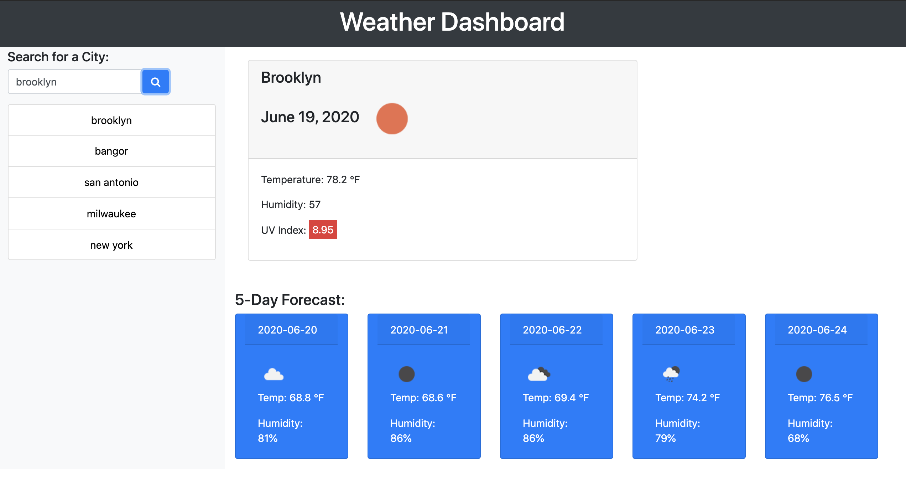

# Weather Dashboard

A weather dashboard that uses the OpenWeather API to source weather data & allows a user to search & retrieve some current weather info for a specific city, its 5-day forecast & saves city search history.

Link to the deployed app is here: https://roccolosito.github.io/weatherDashboard/

This is how the Dashboard looks after submitting a search for a city's weather & forecast.

